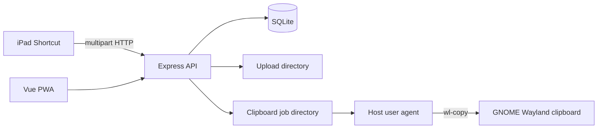

# Architecture

Express validates authentication/input, persists upload metadata and preferences, and serves the built PWA. Uploads, SQLite, and clipboard jobs are bind-mounted. The unprivileged host agent is the only component with Wayland clipboard access.
